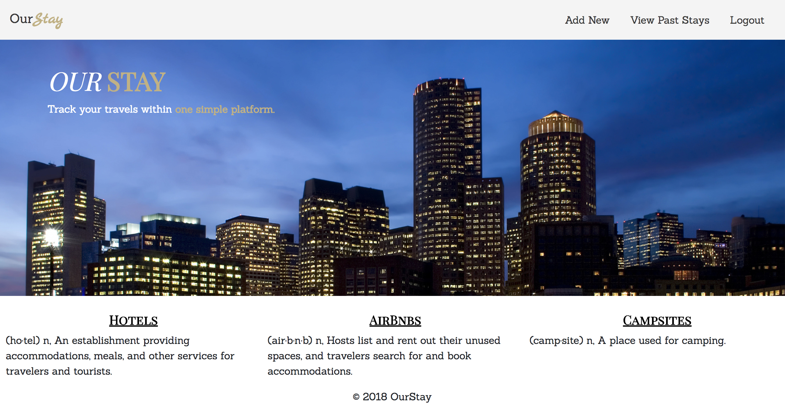

# OurStay

OurStay is a web app designed to allow users to track all of the previous locations where they have stayed during their travels. Each time a user plans to travel again they can visit this app and view their past stays to consider staying there again.




# Tools Used:

- HTML
- Sass
- Bootstrap
- Firebase
- JQuery
- AngularJS

# Fork or Download

Fork or download the OurStay repo then follow these instructions while in the OurStay directory:

```
npm install
grunt
```
